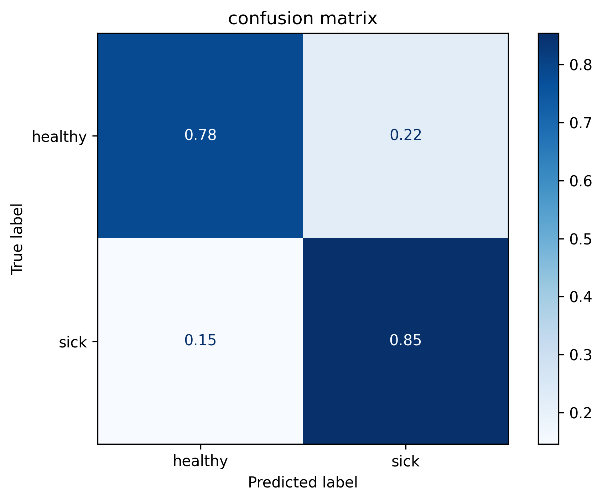

# Multi Layer Perceptron Lab (ENSIAS S4 2IA's MAJOR)

this project implements, trains, validates, and tests a Multi Layer Perceptron structure using Pytorch, respecting the specifications of **1st Deep Learning Lab of 2IA's major at ENSIAS (4th semester)**.  

### architecture (specified in the lab):   
- input layer : input_dim features (dynamic)  
- 1st fully conneced hidden layer : 32 neurons + ReLU activation  
- 2nd fully connected hidden layer : 16 neurons + ReLU activation  
- output layer : 2 classes (no activation, we use cross entropy as the criterion, which converts logits to probas automatically)  

### training data:  
we use the `Heart Disease UCI dataset` (over 900 data points), after preprocessing it, see `data/preprocess.ipynb`  


### metrics: 
since our task is a binary classification for maximising the heart disease detection (minimizing False Negatives), we focus on the `Recall metric` to evaluate the model in the testing phase (89 data points).   
however, we also implemented a classification report function, we get the following metrics:   

| class        | precision | `recall` | F1-score | support |
|--------------|-----------|--------|----------|---------|
| Healthy      | 0.82      | 0.78   | 0.80     | 41      |
| Sick         | 0.82      | `0.85`   | 0.84     | 48      |
| **Accuracy** |           |        | **0.82** | 89      |
| **Macro avg**| 0.82      | 0.82   | 0.82     | 89      |
| **Weighted avg** | 0.82 | 0.82   | 0.82     | 89


#### confusion matrix: 
<p align="center">
  
</p>


### how to run: 
- **clone the repo:**
```bash
#clone the repo 
git clone https://github.com/zakariaaithssain/MLPerceptron.git
```   

using `uv` python package manager:   

- set up the environment:  
```bash
#make sure you have uv
uv --version
#if not install it: 
curl -LsSf https://astral.sh/uv/install.sh | sh
 
#then uv will setup things
uv sync
```   

- run: 
```bash
#if you want to train the model
uv run -m src.train 
#test
uv run -m src.test
```

- or just use regular python setup:   
```bash
python -m venv .venv
source .venv/bin/activate
#this is too slow use uv hhhhh
python -m pip install -r requirements.txt
#then after setup: 
#train
python -m src.train
#test
python -m src.test
```
check also the `preprocess.ipynb` if you would want to make further feature selection and data preprocessing.  


